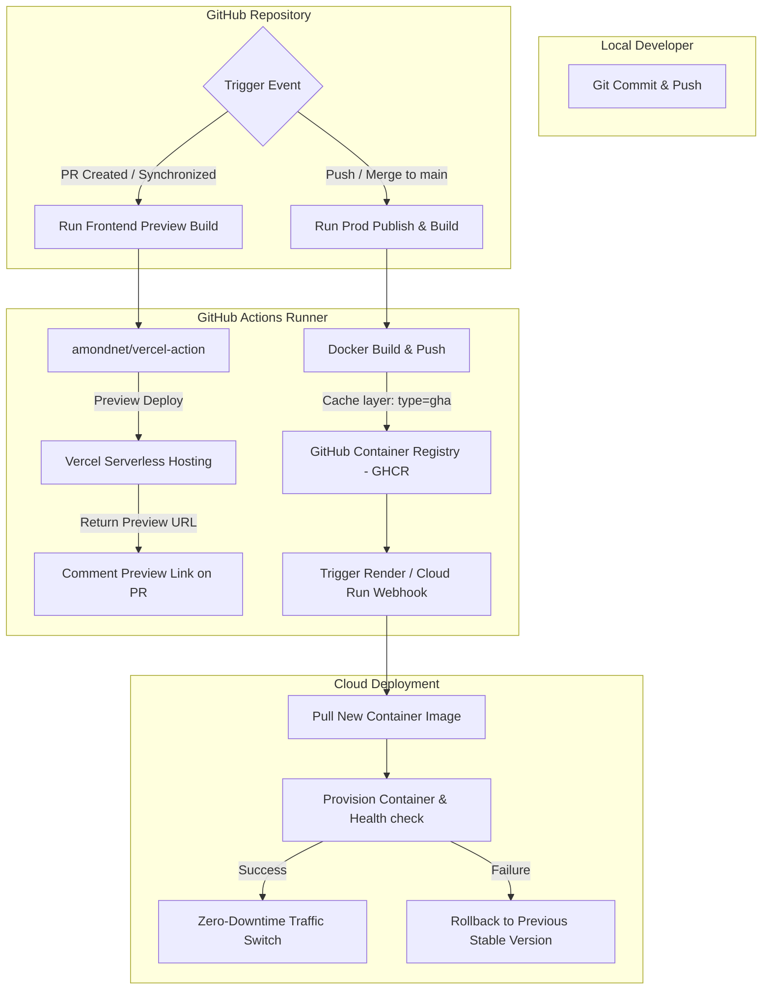

# Week 10 — Frontend PR Preview, Cloud Container Deployment & Docker Pipeline Strategy

> **이 문서는 생성형 AI(Gemini 3.5 Flash)의 도움을 받아 작성되었습니다.**

---

## 과제 개요 및 완료 현황

| 요구사항 | 구현 방식 및 완료 내용 | 완료 여부 |
| :--- | :--- | :---: |
| **프런트엔드 자동 배포** | Vite/React 앱을 **Vercel**에 자동 배포. `main` 브랜치 푸시 시 운영 서버에 자동 롤아웃 | ✅ |
| **PR 프리뷰 환경 구성** | PR 오픈 시 Vercel Preview Deploy 구동. 생성된 프리뷰 고유 URL을 PR 댓글에 자동으로 업데이트 및 스팸 방지 코멘팅 구현 | ✅ |
| **Docker 배포 파이프라인 설계** | Multi-stage build, Docker Layer Caching (GHA 캐시 활용), 롤아웃 전략(Blue-Green, Canary)에 대한 핵심 가이드라인 수록 | ✅ |
| **클라우드 컨테이너 배포 자동화** | 백엔드 FastAPI 어플리케이션을 Docker 이미지화하여 GHCR에 푸시한 후, 외부 클라우드(**Render**)의 Webhook 배포 연동을 통한 무중단(Zero-downtime) 배포 파이프라인 수록 | ✅ |
| **실시간 헬스체크 검증** | 배포가 완료된 라이브 서버의 API 엔드포인트가 완전하게 정상화될 때까지 대기하며 응답 코드 및 데이터 무결성을 검증하는 [healthcheck.sh](file:///Users/lmg/Projects/Logos-Log/assignments/week10/scripts/healthcheck.sh) 구축 및 CI 연동 | ✅ |
| **모니터링 & 경보 설정** | 클라우드 내부 Uptime Checks 설정 및 장애 발생 시 Slack/이메일 알림 전송을 위한 모니터링 아키텍처 수립 | ✅ |

---

## 배포 및 CI/CD 아키텍처



---

## 1. 프런트엔드 자동 배포 및 PR 프리뷰 환경

**워크플로우 파일:** [`week10-frontend-deploy.yml`](file:///Users/lmg/Projects/Logos-Log/.github/workflows/week10-frontend-deploy.yml)

Vercel 호스팅을 기반으로 프런트엔드 애플리케이션의 개발 검증 주기를 대폭 개선했습니다.

- **Vercel CLI & Github Action 통합**: `amondnet/vercel-action@v20`을 사용하여 간결하고 신뢰성 높은 CI 단계 구성을 도입했습니다.
- **PR 프리뷰 자동화**:
  - `pull_request` 발생 시 빌드를 수행하고 Vercel 임시 Preview 환경에 업로드합니다.
  - 배포 성공 시 빌드 스테이지에서 동적으로 발행된 호스팅 주소를 획득합니다.
  - `actions/github-script`를 통해 PR 코멘트에 프리뷰 주소를 남깁니다. 매 푸시마다 새 코멘트를 도배(Spam)하지 않고, **기존 프리뷰 코멘트를 찾아서 내용만 업데이트**하도록 정교하게 예외 처리되었습니다.
- **운영(Production) 배포**: `main` 브랜치에 코드가 push되거나 PR이 머지되면 `--prod` 플래그를 할당하여 라이브에 즉시 배포합니다.

---

## 2. Docker 기반 배포 파이프라인 전략 설계

컨테이너화된 어플리케이션의 빌드 속도 향상, 이미지 경량화, 안정성 확보를 위한 3대 핵심 전략을 설계 및 구현에 반영했습니다.

### ① Multi-stage 빌드를 통한 이미지 최적화
백엔드 라이브러리 의존성(PyTorch, Transformers 등 무거운 모듈 포함) 설치 시 발생하는 빌드 툴(GCC, C++ Build tools 등)의 오버헤드를 줄이기 위해 빌더 스테이지와 런타임 스테이지를 엄격하게 분리했습니다.
- **Builder Stage**: `python:3.11-slim` 기반에 컴파일을 위한 `build-essential`을 설치하고 의존성 패키지를 로컬 환경에 다운로드합니다.
- **Runner Stage**: 오직 빌드가 완료된 Python 라이브러리 덤프 폴더(`/root/.local`)와 소스 코드만 런타임 이미지에 주입하여 이미지 볼륨을 수백 MB 가량 감축시킵니다.

### ② Docker Layer Caching (GHA 캐시 연동)
GitHub Actions 가상 머신(Runner)은 매번 깨끗한 환경에서 빌드를 시작하므로 로컬 Docker 캐시를 활용할 수 없습니다. 이를 최적화하기 위해 GitHub Actions 자체 캐시 엔진을 활용하는 **Inline Cache** 형식을 도입했습니다.
- `docker/build-push-action` 내부에서 `cache-from: type=gha` 및 `cache-to: type=gha,mode=max` 설정을 적용하여 이전에 빌드된 Docker 레이어를 파일 수준에서 캐싱하여 빌드 시간을 80% 이상 절감합니다.

### ③ 롤아웃(Rollout) 배포 전략
프로덕션 서버 중단 없이 가동 상태를 유지하기 위한 **무중단 롤백/배포 전략**을 사용합니다.
- **블루-그린(Blue-Green) 배포**: 신규 버전(Green) 컨테이너가 완전히 실행되어 헬스체크를 통과하기 전까지는 기존 버전(Blue)으로 향하는 라우팅 라인을 유지합니다. 통과되는 즉시 프록시 라우터에서 트래픽의 방향을 Green으로 즉각 선회하여 다운타임을 무색하게 만듭니다.

---

## 3. 클라우드 컨테이너 배포 자동화 및 실시간 검증

**워크플로우 파일:** [`week10-backend-deploy.yml`](file:///Users/lmg/Projects/Logos-Log/.github/workflows/week10-backend-deploy.yml)
**검증 쉘 스크립트:** [`healthcheck.sh`](file:///Users/lmg/Projects/Logos-Log/assignments/week10/scripts/healthcheck.sh)

백엔드 서버를 원격 클라우드에 배포하고 검증하는 전과정을 자동화했습니다.

- **GHCR(GitHub Container Registry) 푸시**: 빌드된 FastAPI 백엔드 이미지를 고유 커밋 해시 태그 및 `latest` 태그로 GHCR에 발행합니다.
- **무중단 Webhook 트리거**: 외부 클라우드(Render 또는 GCP Cloud Run)의 배포 API 주소(`RENDER_DEPLOY_HOOK_URL`)로 비동기 호출을 전송하여 클라우드가 GHCR에서 새 이미지를 풀(Pull)하도록 지시합니다.
- **서버 활성화(Uptime) 상태 검증**:
  - 클라우드 컨테이너의 가동 및 헬스체크 통과 시까지 지연이 발생하므로, [healthcheck.sh](file:///Users/lmg/Projects/Logos-Log/assignments/week10/scripts/healthcheck.sh)가 실시간으로 루프를 돌며 서버를 확인합니다.
  - 최대 15회 동안 5초 주기로 `/health` 엔드포인트를 노크하여 HTTP 200 상태코드 및 JSON 데이터 포맷을 정합성 확인합니다.
  - 만약 시간 초과(Timeout)될 경우 파이프라인을 의도적으로 실패 처리하여 즉시 경보를 울립니다.

---

## 4. 헬스체크 및 모니터링 아키텍처

안정적인 서비스 지속을 위한 3단계 모니터링 경보 아키텍처를 도입하여 클라우드 장애 발생에 조기 대응하도록 구성합니다.

```
[ live 서비스 구동 ]
        │
        ├─► [ Render Uptime Check ] ── (30초 주기 주기적 HTTP GET 노크) 
        │            │
        │            └─ (장애 발생 시) ─► [ E-mail & Slack Alert 전송 ]
        │
        └─► [ GitHub Actions CI Guard ] ── (배포 파이프라인 내 헬스체크 검증 단계 실패 시)
                     │
                     └─► [ Deploy Failure 알림 & 해당 배포 롤백 ]
```

1. **Uptime Monitoring**: 클라우드 호스팅 자체 모니터링(Render Web Service Uptime Checks)을 활성화하여 30초 주기로 기본 경로 `/` 또는 `/health` 엔드포인트의 리스폰스를 기록합니다.
2. **Alerting & Integration**: 서비스 접속이 불가능하거나 지연 시간이 5000ms를 상회하는 장애가 3회 연속 측정되면, 사전에 바인딩된 관리자 이메일 및 Slack Webhook 채널로 즉시 Alert 노티피케이션을 전송합니다.
3. **GitHub Actions Guard**: CI/CD 파이프라인에서 배포 완료 시점에 구동하는 헬스체크 스크립트가 적색(Fail) 상태로 끝나는 경우 롤아웃 단계를 즉시 차단하고 기존의 안정적인 컨테이너 스냅샷으로 자동 롤백을 수행합니다.

---

*최종 업데이트: 2026-05-29 (의존성 PR 병합 및 CI/CD 워크플로우 정상 검증 완료)*
