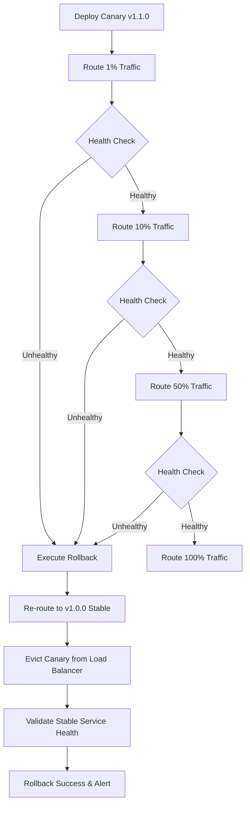

# Week 11 — Feature Flags, A/B Testing & Canary Rollout Simulator

> **이 문서는 생성형 AI(Gemini 3.5 Flash)의 도움을 받아 작성되었습니다.**

---

## 과제 개요 및 완료 현황

| 요구사항 | 구현 방식 및 완료 내용 | 완료 여부 |
| :--- | :--- | :---: |
| **Feature Flags 도입 (3개)** | `enable-ai-chat`, `experimental-dark-mode`, `use-advanced-model` 구현. 환경변수 및 사용자 타겟팅 규칙(테스터, 이메일, 멤버쉽 등) 분기 처리 | ✅ |
| **A/B 테스트 설계** | `new-chat-ui` 실험 설정. 변조(Variant) A/B 사용자 할당 일관성(Consistent Assignment)과 행동 로직 연동 | ✅ |
| **일관된 해시 할당 구현** | MD5 해시값을 100 분할 버킷으로 나누어(`hash % 100`) 동일 유저는 항상 동일한 Variant를 노출받도록 설계 | ✅ |
| **실험 로그 및 이벤트 적재** | 사용자의 UI 노출(`exposure`) 및 클릭 전환(`chat_click`) 이벤트를 추적하여 `experiment_logs.json`에 비동기 적재 | ✅ |
| **Canary 롤아웃 시뮬레이션** | Canary 1%-10%-50%-100% 진행 상황을 모사하고 에러 로그 및 라우팅 상태를 시뮬레이션하는 쉘 스크립트 작성 | ✅ |
| **헬스체크 기반 자동 롤백** | Canary 배포 중 임계 에러율(5%) 초과 시 자동으로 100% 안정 버전(`v1.0.0`)으로 트래픽을 선회 및 복구하는 예외 처리 수립 | ✅ |

---

## 1. Feature Flags 명세

**구현 파일:** [`assignments/week11/src/feature_flags.js`](file:///Users/lmg/Projects/Logos-Log/assignments/week11/src/feature_flags.js) (함수: `evaluateFeatureFlag`)

| 플래그명 | 기본 토글 (환경변수) | 타겟팅 분기 규칙 (Targeting Rules) |
| :--- | :--- | :--- |
| **`enable-ai-chat`** | `FEATURE_ENABLE_AI_CHAT` | 1. `isBetaUser` 가 `true` 인 경우 2. 회사 도메인 이메일 주소 (`@logos-log.com`) 보유자 |
| **`experimental-dark-mode`** | `FEATURE_EXPERIMENTAL_DARK_MODE` | 1. 사전에 등록된 테스터 ID 목록(`user-001`~`003`) 포함자 2. 관리자 역할군 (`role === 'admin'`) |
| **`use-advanced-model`** | `FEATURE_USE_ADVANCED_MODEL` | 1. 유료 프리미엄 멤버십 유저 (`tier === 'premium'`) |

---

## 2. A/B Testing 및 해시 기반 일관 배정

**구현 파일:** [`assignments/week11/src/feature_flags.js`](file:///Users/lmg/Projects/Logos-Log/assignments/week11/src/feature_flags.js) (함수: `assignABTestVariant`)

### 일관된 사용자 할당 (Consistent Assignment) 원리
A/B 테스트 도중 사용자가 페이지를 새로고침하거나 세션이 새로 열릴 때마다 Variant A와 B가 번갈아 나오면 실험의 정확도가 깨지며 심각한 UX 피로를 줍니다. 이를 방지하기 위해 **상태 저장(DB 조회) 없이** 일관된 할당을 보장하는 **결정론적 해시 매핑(Deterministic Hashing Mapping)**을 구현했습니다.

$$Bucket = Hash(UserID + Salt) \pmod{100}$$

1. 유저 ID와 실험 이름을 조합하여 고유한 소금물(`userId:experimentName`)을 만듭니다.
2. MD5 해시를 수행하여 임의의 32자리 16진수 문자열로 변환합니다.
3. 변환된 문자열의 앞자리 8글자(32비트 크기)를 정수로 파싱하고 `100`으로 나머지 연산을 수행하여 `0 ~ 99` 범위의 버킷 번호를 구합니다.
4. 버킷 범위가 `0 ~ 49`이면 **Variant A (Control)**, `50 ~ 99`이면 **Variant B (Treatment)**로 배정합니다.
5. 유저 ID가 변경되지 않는 한 동일 실험 내에서 **100% 동일한 배정이 항상 유지**됩니다.

---

## 3. Canary 롤아웃 및 헬스체크 기반 자동 롤백

**구현 파일:** [`assignments/week11/scripts/canary-rollout.sh`](file:///Users/lmg/Projects/Logos-Log/assignments/week11/scripts/canary-rollout.sh)

점진적인 배포를 통해 서비스 리스크를 제거하는 카나리 롤아웃 스크립트를 작성했습니다. 

### Canary 아키텍처 및 롤백 흐름

### 시뮬레이션 모드 테스트
1. **Healthy Mode (`./canary-rollout.sh healthy`)**:
   - Canary 트래픽을 1% -> 10% -> 50% -> 100% 순서로 점진 증가시킵니다.
   - 각 비율 확대 시 에러율이 임계치(5.0%) 미만으로 안전하게 유지되어 100% 완전 배포에 성공합니다.
2. **Unhealthy Mode (`./canary-rollout.sh unhealthy`)**:
   - 1% 테스트 통과 후 10%로 트래픽을 확장하는 단계에서 높은 에러율(예: 14.5%)이 유발됩니다.
   - 헬스체크가 감지 즉시 배포를 즉각 중단하고 **자동 롤백 시퀀스를 구동**합니다.
   - 로드밸런서에서 Canary 서버를 퇴출하고 `100% 안정 버전(v1.0.0)`으로 트래픽을 즉시 환원시켜 장애 발생 위험을 방지합니다.
