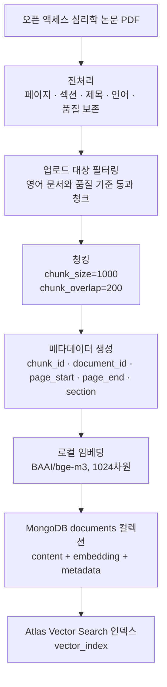
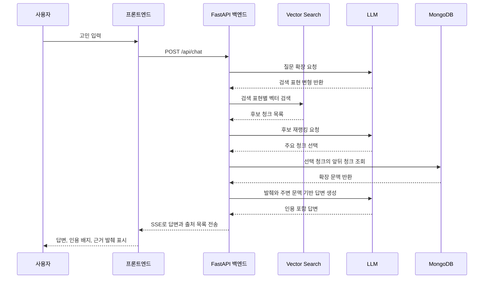

# Logos-Log RAG 아키텍처 다이어그램

이 문서는 발표나 포트폴리오 설명에서 Logos-Log의 RAG 흐름을 한눈에 보여주기 위한 한국어 다이어그램 문서입니다. 전체 시스템 아키텍처는 [architecture.md](./architecture.md)를 참고하고, 발표에서는 이 문서의 다이어그램을 중심으로 설명하면 됩니다.

## 핵심 요약

Logos-Log의 RAG는 사용자의 한국어 고민을 바로 LLM에 보내지 않습니다. 먼저 학술 검색에 적합한 영어 검색 표현으로 확장하고, MongoDB Atlas Vector Search에서 관련 연구 발췌를 찾은 뒤, 재랭킹과 주변 청크 확장을 거쳐 답변 생성에 사용합니다. 사용자는 답변의 인용 배지와 출처 카드를 통해 어떤 근거가 사용됐는지 확인할 수 있습니다.

## 발표용 한 장 다이어그램

```mermaid
flowchart LR
    User["사용자 고민 입력<br/>예: 성과가 없으면 가치가 없는 것 같아요"]
    Frontend["React 채팅 UI<br/>SSE 스트리밍 수신"]
    API["FastAPI 채팅 API"]
    Safety["위기 신호 감지<br/>자해/자살 표현 우선 처리"]
    Expand["질문 확장<br/>한국어 고민 → 영어 학술 검색 표현"]
    Embed["쿼리 임베딩<br/>BAAI/bge-m3"]
    Vector["MongoDB Atlas<br/>$vectorSearch"]
    Merge["후보 병합<br/>chunk_id 기준 중복 제거"]
    Rerank["LLM 재랭킹<br/>주요 근거 최대 4개 선택"]
    ExpandContext["주변 청크 확장<br/>앞뒤 청크로 문맥 보강"]
    Generate["답변 생성<br/>gpt-4o-mini"]
    EvidenceUI["근거 표시 UI<br/>인용 배지 · 출처 카드 · 출처 모달"]
    Store["MongoDB 저장<br/>대화와 출처 스냅샷"]

    User --> Frontend
    Frontend --> API
    API --> Safety
    Safety -->|위기 아님| Expand
    Safety -->|위기 감지| Frontend
    Expand --> Embed
    Embed --> Vector
    Vector --> Merge
    Merge --> Rerank
    Rerank --> ExpandContext
    ExpandContext --> Generate
    Generate --> Frontend
    Generate --> Store
    Rerank --> EvidenceUI
    EvidenceUI --> Frontend
```

## 데이터 준비 파이프라인

## 답변 생성에서 근거가 쓰이는 방식

## 발표 설명 문장

발표에서는 다음 순서로 설명하면 자연스럽습니다.

1. 사용자의 고민은 바로 LLM으로 가지 않고, 먼저 안전 감지를 거칩니다.
2. 일반 한국어 문장은 영어 학술 검색 표현으로 확장됩니다.
3. 검색은 프로덕션에서 벡터 단독 방식으로 수행합니다. 하이브리드 검색은 평가에서 더 낮게 나와 기본값에서 제외했습니다.
4. 검색된 청크는 그대로 쓰지 않고, 재랭킹으로 주요 근거를 고릅니다.
5. 답변 생성에는 선택 청크뿐 아니라 앞뒤 청크를 함께 넣어 문맥 손실을 줄입니다.
6. 프론트엔드는 답변과 함께 인용 배지, 출처 카드, 출처 모달을 보여줍니다.
7. UI가 `논문 전체 요약`이 아니라 `근거 발췌`라고 말하는 이유는, 시스템이 실제로 사용한 근거의 범위를 정직하게 보여주기 위해서입니다.

## 설계 판단 포인트

| 판단 | 선택 | 이유 |
|------|------|------|
| 프로덕션 검색 | 벡터 단독 | `$text` 하이브리드/RRF가 평가에서 더 낮게 나와 기본 도입하지 않음 |
| 답변 근거 | 검색 청크 + 주변 청크 | 검색 정밀도와 문맥 보존을 함께 확보하기 위함 |
| 출처 표시 | 인용 배지 + 출처 카드 + 출처 모달 | 사용자가 답변 근거를 직접 확인할 수 있게 하기 위함 |
| 검증기 기본값 | 꺼짐 | verifier 실험이 전체 평가에서 안정적인 개선을 만들지 못했기 때문 |
| 다음 개선 목표 | Faithfulness | 검색 지표는 목표를 통과한 적이 있고, 답변 충실도가 남은 병목이기 때문 |

## 발표 시 주의할 표현

- “논문 전체를 읽고 답합니다”라고 말하지 않습니다.
- “연구적으로 검증된 치료 효과를 제공합니다”라고 말하지 않습니다.
- “검색된 연구 발췌와 주변 문맥을 근거로 성찰을 돕습니다”라고 설명합니다.
- “검색 지표는 개선됐지만 Faithfulness는 아직 개선 대상입니다”라고 정직하게 말합니다.
